# Diagram Codes for Graduation Report

This file contains Mermaid code for all diagrams in the graduation report.
Use https://mermaid.live/ to generate the diagrams.

## How to Use:
1. Go to https://mermaid.live/
2. Copy the code for each diagram below
3. Paste it into the Mermaid Live Editor
4. The diagram will generate automatically
5. Download as PNG or SVG
6. Replace the text-based diagrams in your report with the generated images

---

## DIAGRAM 1: High-Level System Architecture
**Location:** Chapter 1.6 - System Overview (Figure 1)
**Type:** Flowchart / Architecture Diagram

```mermaid
graph TB
    subgraph CLIENT["CLIENT LAYER"]
        CI[Client Interface<br/>React]
        RD[Restaurant Dashboard<br/>React]
        AD[Admin Dashboard<br/>React]
    end

    subgraph APP["APPLICATION LAYER"]
        API[Express.js REST API Server<br/>Authentication | Products | Orders | Sales]
    end

    subgraph DATA["DATA LAYER"]
        DB[(PostgreSQL Database<br/>Users | Restaurants | Products | Orders)]
    end

    subgraph EXT["EXTERNAL SERVICES"]
        CL[Cloudinary<br/>Image CDN]
        SMTP[SMTP<br/>Email]
        NOM[Nominatim/<br/>OpenStreetMap]
    end

    CI --> API
    RD --> API
    AD --> API
    API --> DB
    API -.-> CL
    API -.-> SMTP
    API -.-> NOM

    style CLIENT fill:#e1f5ff
    style APP fill:#fff4e1
    style DATA fill:#f0ffe1
    style EXT fill:#ffe1f5
```

**Instructions:**
- Copy the code above into Mermaid Live Editor
- Download as PNG (recommended 1200px width)
- Replace the text diagram in Chapter 1.6

---

## DIAGRAM 2: Project Timeline (Gantt Chart)
**Location:** Chapter 7.1.1 - Project Timeline (Figure 9)
**Type:** Gantt Chart

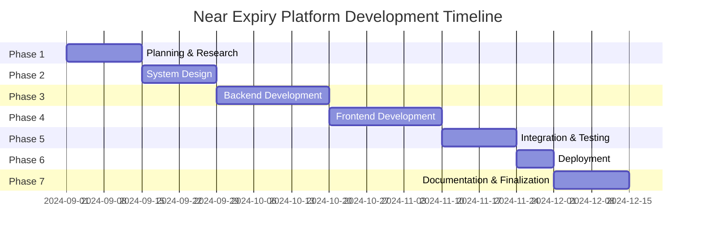

**Instructions:**
- Copy the code above into Mermaid Live Editor
- Download as PNG (recommended 1400px width)
- Replace the text timeline in Chapter 7.1.1

---

## DIAGRAM 3: Database Entity-Relationship Diagram
**Location:** Chapter 3 - Design (Database Schema)
**Type:** ER Diagram

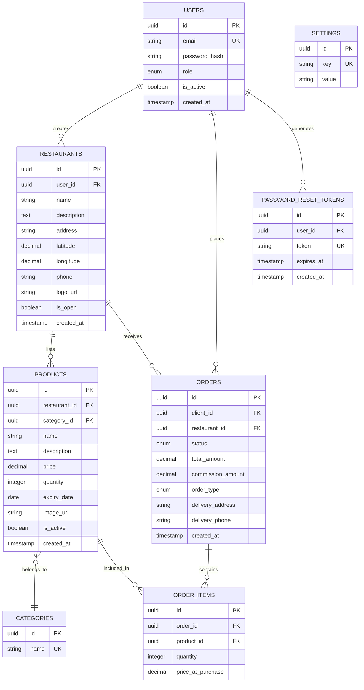

**Instructions:**
- Copy the code above into Mermaid Live Editor
- Download as PNG (recommended 1600px width for readability)
- Insert in Chapter 3 Database Design section

---

## DIAGRAM 4: User Flow - Client Journey
**Location:** Chapter 1.6 - System Overview (Client Flow)
**Type:** Flowchart

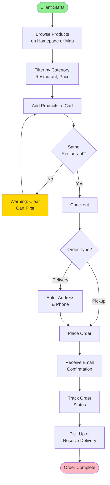

**Instructions:**
- Copy the code above into Mermaid Live Editor
- Download as PNG (recommended 1000px width)
- Can be inserted in Chapter 1.6 or Chapter 3

---

## DIAGRAM 5: User Flow - Restaurant Journey
**Location:** Chapter 1.6 - System Overview (Restaurant Flow)
**Type:** Flowchart

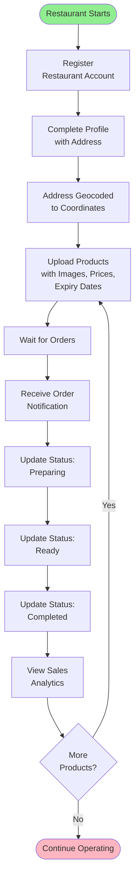

**Instructions:**
- Copy the code above into Mermaid Live Editor
- Download as PNG (recommended 800px width)
- Can be inserted in Chapter 1.6 or Chapter 3

---

## DIAGRAM 6: User Flow - Admin Journey
**Location:** Chapter 1.6 - System Overview (Admin Flow)
**Type:** Flowchart

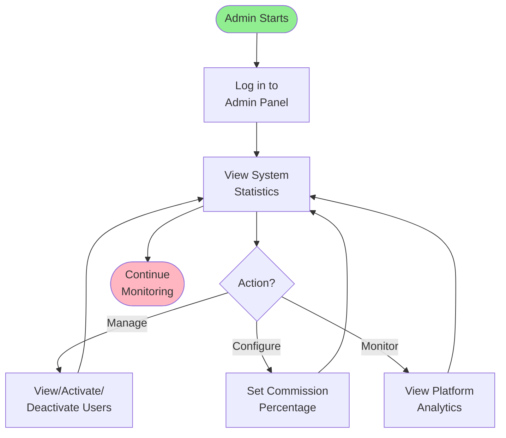

**Instructions:**
- Copy the code above into Mermaid Live Editor
- Download as PNG (recommended 600px width)
- Can be inserted in Chapter 1.6 or Chapter 3

---

## DIAGRAM 7: API Architecture
**Location:** Chapter 4 - Implementation
**Type:** Component Diagram

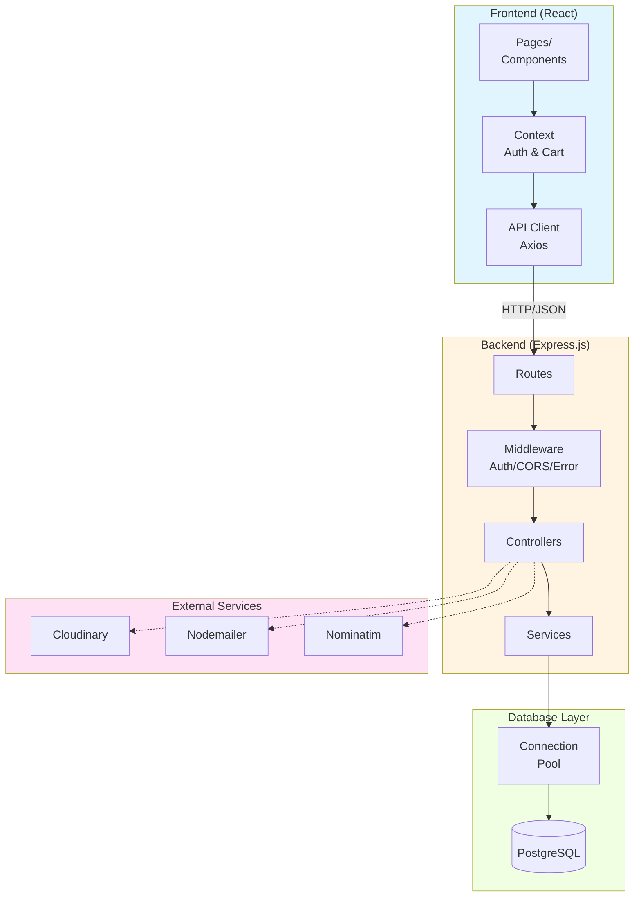

**Instructions:**
- Copy the code above into Mermaid Live Editor
- Download as PNG (recommended 1200px width)
- Insert in Chapter 4.2 Backend Architecture

---

## DIAGRAM 8: Authentication Flow
**Location:** Chapter 4 - Implementation (Authentication)
**Type:** Sequence Diagram

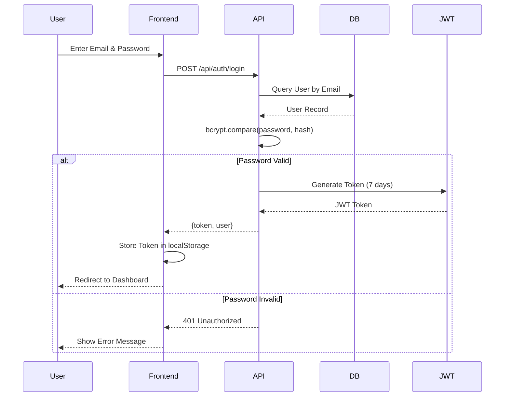

**Instructions:**
- Copy the code above into Mermaid Live Editor
- Download as PNG (recommended 1000px width)
- Insert in Chapter 4.2.3 Authentication

---

## DIAGRAM 9: Order Processing Flow
**Location:** Chapter 4 - Implementation (Order Processing)
**Type:** Sequence Diagram

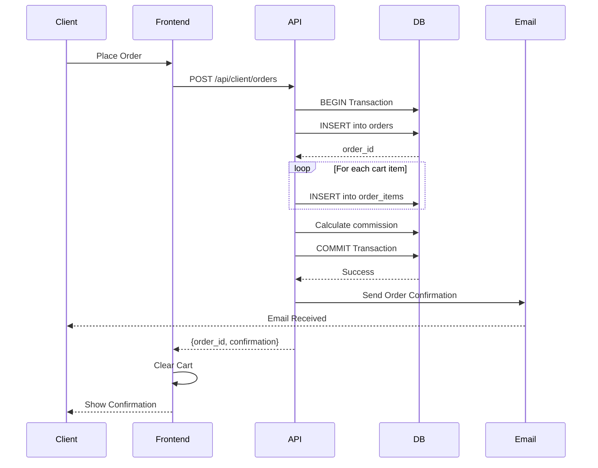

**Instructions:**
- Copy the code above into Mermaid Live Editor
- Download as PNG (recommended 1200px width)
- Insert in Chapter 4.2.5 Order Processing

---

## DIAGRAM 10: Docker Deployment Architecture
**Location:** Chapter 4.5 - Docker Deployment
**Type:** Component Diagram

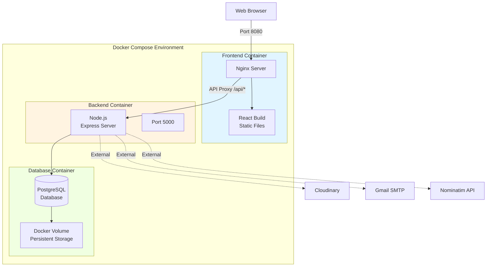

**Instructions:**
- Copy the code above into Mermaid Live Editor
- Download as PNG (recommended 1200px width)
- Insert in Chapter 4.5 Docker Deployment

---

## DIAGRAM 11: System Testing Pyramid
**Location:** Chapter 5.3 - Testing Results
**Type:** Flowchart/Pyramid

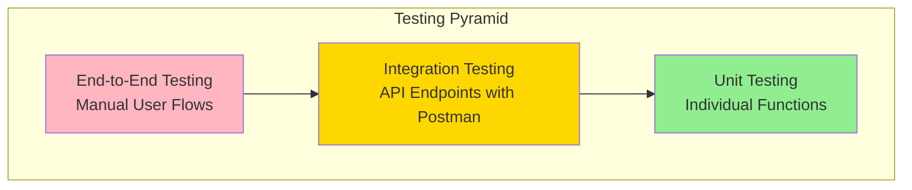

**Instructions:**
- Copy the code above into Mermaid Live Editor
- Download as PNG (recommended 600px width)
- Insert in Chapter 5.3 Testing Results

---

## DIAGRAM 12: Risk Management Matrix (Visual)
**Location:** Chapter 7.4 - Risk Management
**Type:** Quadrant Chart

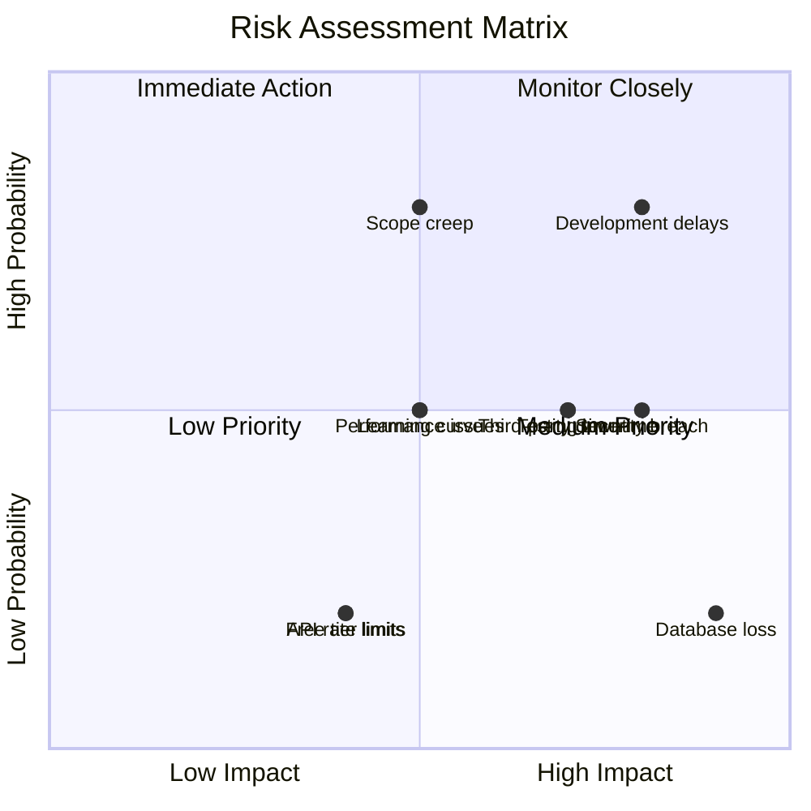

**Instructions:**
- Copy the code above into Mermaid Live Editor
- Download as PNG (recommended 800px width)
- Insert in Chapter 7.4.1 Risk Assessment Matrix

---

## ALTERNATIVE: Use draw.io for Complex Diagrams

If you want more customization, you can also use:
- **draw.io** (https://app.diagrams.net/)
- Just import the Mermaid code or create manually

## Tips for Best Results:

1. **Mermaid Live Editor Settings:**
   - Use PNG format for Word/PDF documents
   - Set width to at least 1200px for clarity
   - Use SVG if inserting into web/markdown

2. **Color Customization:**
   - The `style` commands in the code set colors
   - Modify hex colors as needed (e.g., `fill:#e1f5ff`)

3. **Font Size:**
   - Mermaid auto-scales fonts
   - For larger diagrams, download at higher resolution

4. **Replacing in Report:**
   - After generating PNG images, insert them in place of text diagrams
   - Keep original text as alt-text for accessibility

---

**Total Diagrams:** 12
**Status:** ✅ All diagram codes ready
**Next Step:** Generate images at https://mermaid.live/ and insert into report
